# AtomQuest Goal Tracker - Full System Architecture

This document provides an in-depth breakdown of the AtomQuest Goal Tracker architecture, exploring the full project structure, advanced features, and data flow.

## 1. System Architecture Diagram

```mermaid
graph TB
    %% Definitions
    classDef frontend fill:#3b82f6,stroke:#1d4ed8,stroke-width:2px,color:#fff;
    classDef backend fill:#10b981,stroke:#047857,stroke-width:2px,color:#fff;
    classDef database fill:#f59e0b,stroke:#b45309,stroke-width:2px,color:#fff;
    classDef external fill:#6b7280,stroke:#374151,stroke-width:2px,color:#fff;
    classDef feature fill:#8b5cf6,stroke:#5b21b6,stroke-width:2px,color:#fff;

    %% Actors
    ActorAdmin([Admin User]):::external
    ActorManager([Manager User]):::external
    ActorEmployee([Employee User]):::external

    subgraph Frontend [Frontend Client - React / Vite]
        direction TB
        
        %% Core Routing & Layout
        Router[React Router & ProtectedRoute]:::frontend
        Layout[App Layout<br/>Navbar & Sidebar]:::frontend
        
        %% Advanced Features
        subgraph Features [Productivity & Gamification Features]
            Pomodoro(Pomodoro Timer):::feature
            AI_Assist(AI Assistant):::feature
            Gamification(Achievements & Stats):::feature
            DemoMode(Demo Mode Toggle):::feature
        end

        %% Role-Based Pages
        subgraph Pages [Role-Based Pages]
            direction LR
            subgraph Admin[Admin Pages]
                AdminDash(Dashboard)
                Users(Users)
                Audit(Audit Logs)
                Reports(Reports)
            end
            subgraph Manager[Manager Pages]
                ManagerDash(Dashboard)
                TeamGoals(Team Goals)
                Reviews(Reviews)
            end
            subgraph Employee[Employee Pages]
                EmpDash(Dashboard)
                Goals(My Goals)
                Checkins(Check-ins)
            end
        end

        %% State & API layer
        Hooks[Custom Hooks<br/>useGoals, useGamification]:::frontend
        API[Axios API Service]:::frontend
        
        %% Internal Frontend Flow
        Router --> Layout
        Layout --> Pages
        Pages --> Features
        Pages --> Hooks
        Features --> Hooks
        Hooks --> API
    end

    subgraph Backend [Backend Server - Node.js / Express]
        direction TB
        Server[Express Server]:::backend
        
        %% Middleware
        subgraph Middleware [Middleware]
            JWTAuth(JWT Authentication):::backend
            RoleCheck(Role Authorization):::backend
        end
        
        %% Controllers
        subgraph Controllers [Controllers]
            AuthCtrl(Auth Controller):::backend
            GoalCtrl(Goal Controller):::backend
        end
        
        %% Models
        subgraph Models [Mongoose Models]
            UserModel(User Model):::backend
            GoalModel(Goal Model):::backend
        end
        
        %% Internal Backend Flow
        Server --> Middleware
        Middleware --> Controllers
        AuthCtrl --> UserModel
        GoalCtrl --> GoalModel
    end

    subgraph Database [Database]
        MongoDB[(MongoDB)]:::database
    end

    %% External Connections
    ActorAdmin -.-> |Access| Router
    ActorManager -.-> |Access| Router
    ActorEmployee -.-> |Access| Router
    
    API ==> |HTTP Requests / REST| Server
    UserModel ==> |Mongoose| MongoDB
    GoalModel ==> |Mongoose| MongoDB
```

## 2. Comprehensive Directory & Component Breakdown

### Frontend (`/frontend/src/`)
Built with **React 19**, **Vite**, **Tailwind CSS**, and **Framer Motion**.

- **Pages (`/pages`)**: Implements strict Role-Based Access Control (RBAC).
  - **Admin**: Full system overview. Includes `AdminDashboard`, `AuditLogs`, `Reports`, and `Users` management.
  - **Manager**: Team oversight. Includes `ManagerDashboard`, `TeamGoals`, and `Reviews`.
  - **Employee**: Individual contributor view. Includes `EmployeeDashboard`, `Goals` management, and `Checkins`.
  - **Auth**: Registration and Login flows.

- **Features (`/features`)**: Advanced platform capabilities that set it apart.
  - **`AIAssistant.jsx`**: Integrates AI features to help users define or track goals.
  - **`PomodoroTimer.jsx`**: Built-in time management tool for deep work.
  - **`AchievementsWidget.jsx` & `GamificationStats.jsx`**: Gamified progression system to keep users engaged.
  - **`DemoModeToggle.jsx`**: Specific functionality tailored for hackathons/pitching.

- **Components (`/Components`)**: Reusable UI elements.
  - **Layouts**: `Sidebar.jsx`, `Navbar.jsx`.
  - **Routing Security**: `ProtectedRoute.jsx` ensuring that a Manager cannot access Admin pages, etc.
  - **Widgets**: `StatCard.jsx`, `GoalForm.jsx`.

- **Hooks & State (`/hooks`, `/context`)**:
  - Encapsulated business logic (`useGoals`, `useGamification`) that abstracts API calls away from the UI components.

### Backend (`/backend/`)
Built with **Node.js**, **Express**, and **Mongoose**.

- **Controllers (`/controllers`)**:
  - `authController.js`: Handles login, registration, and JWT token generation.
  - `goalController.js`: Handles CRUD operations for goals, progress tracking, and gamification state updates.
- **Models (`/models`)**:
  - `User.js`: Defines schema for user data, including their roles (`admin`, `manager`, `employee`) and password hashes.
  - `Goal.js`: Defines schema for objectives, tracking deadlines, status, and associating them with specific users.
- **Routes & Middleware**: Maps incoming API endpoints to the respective controllers, protected by JWT authentication and role-checking middleware.

### Database (`MongoDB`)
- Stores normalized documents for Users and Goals. The architecture uses references (e.g., a Goal belongs to a User ObjectId) to maintain data integrity.

## 3. Data Flow Example: Updating a Goal

1. **User Action**: An employee clicks "Update Progress" on `Goals.jsx`.
2. **Hook Interaction**: `useGoals.js` hook handles the UI state transition.
3. **API Call**: The `Axios API Client` sends a `PUT /api/goals/:id` request with the JWT token in the header.
4. **Backend Middleware**: Express intercepts the request, verifies the JWT, and confirms the user has permissions.
5. **Controller Logic**: `goalController.js` updates the goal progress and checks if it reached 100%. If so, it might trigger Gamification rewards.
6. **Database Operation**: The `Goal` (and potentially `User`) Mongoose models update the MongoDB records.
7. **Response & UI Update**: The backend responds with the updated data, the frontend state updates, and the `GamificationStats` / `GoalList` re-renders dynamically.
