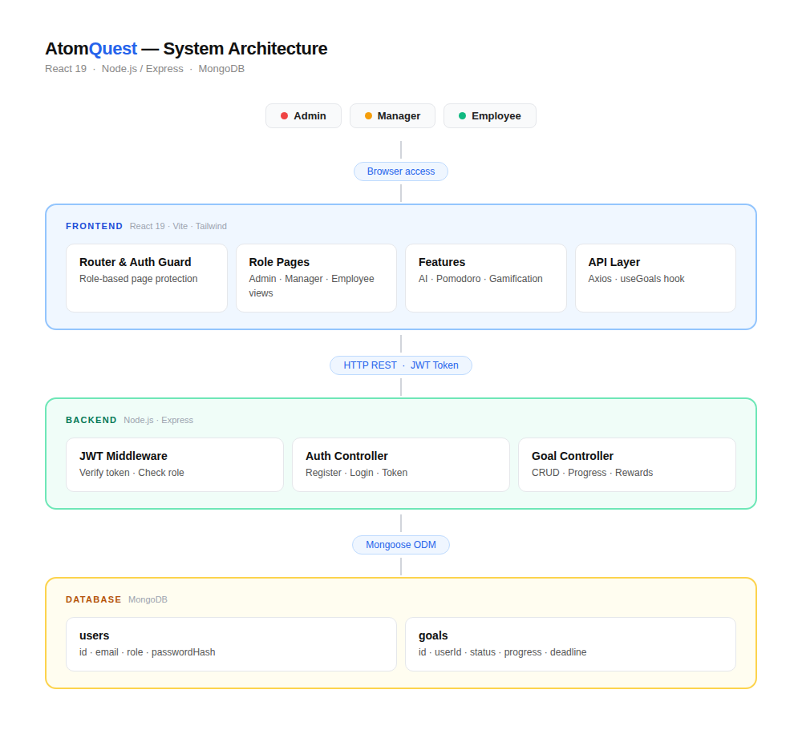

# AtomQuest Goal Tracker Portal

## 🌐 Live Demo Links

### Frontend
https://atom-quest-goal-tracker-portal-umgf.vercel.app

### Backend API
https://atomquestgoaltrackerportal-production.up.railway.app

### GitHub Repository
https://github.com/Shiva132007/AtomQuest_Goal_tracker_portal

---

# AtomQuest Goal Tracker Portal

Welcome to the **AtomQuest Goal Tracker**, a modern, hackathon-ready employee productivity and goal-tracking platform. It is designed to boost workplace engagement using powerful productivity tools, an AI assistant, and a built-in gamification system.

---

# 🏗 System Architecture



---

## 🌟 Key Features

### Role-Based Access Control (RBAC)
The application dynamically adjusts its views and permissions based on user roles:

- **Admin**: Full system oversight, audit logs, user management, and platform-wide reporting.
- **Manager**: Team oversight, tracking team goals, and managing performance reviews.
- **Employee**: Individual goal tracking, check-ins, and daily task management.

---

### Productivity & Engagement Tools

- **Gamification Engine**  
  Users earn achievements and track progression stats as they complete goals, keeping engagement high.

- **Pomodoro Timer**  
  A built-in focus timer to encourage deep work sessions without leaving the platform.

- **AI Assistant**  
  Smart goal setting and productivity guidance powered by an integrated AI widget.

- **Bento Box UI**  
  Premium modern dashboard interface utilizing glassmorphism and Framer Motion animations.

---

## 🛠 Tech Stack

### Frontend
- React 19 (Vite)
- Tailwind CSS v4
- Framer Motion
- Recharts
- React Router v7

### Backend
- Node.js
- Express.js
- MongoDB
- Mongoose
- JWT Authentication
- bcryptjs

---

## 🚀 Installation & Setup Guide

### 1. Clone Repository

```bash
git clone https://github.com/Shiva132007/AtomQuest_Goal_tracker_portal.git

cd AtomQuest_Goal_tracker_portal
```

---

## ⚙ Backend Setup

```bash
cd backend
npm install
```

Create `.env` file inside backend folder:

```env
PORT=5000
MONGODB_URI=your_mongodb_connection
JWT_SECRET=your_secret_key
```

Run backend:

```bash
npm run dev
```

Backend runs on:

```text
http://localhost:5000
```

---

## 💻 Frontend Setup

```bash
cd frontend
npm install
npm run dev
```

Frontend runs on:

```text
http://localhost:5173
```

---

## 📂 Project Structure

```text
AtomQuest_Goal_tracker_portal/
│
├── backend/
│   ├── config/
│   ├── controllers/
│   ├── middleware/
│   ├── models/
│   ├── routes/
│   └── server.js
│
├── frontend/
│   ├── src/
│   │   ├── components/
│   │   ├── features/
│   │   ├── pages/
│   │   ├── hooks/
│   │   └── App.jsx
│   │
│   ├── package.json
│   └── vite.config.js
│
├── ARCHITECTURE.md
└── README.md
```

---

## 🔐 Authentication

The application uses:

- JWT Authentication
- Password Hashing with bcryptjs
- Protected Routes
- Role-based Access Control

---

## 📊 Core Modules

### Employee Dashboard
- Goal Tracking
- Daily Progress
- Pomodoro Timer
- Achievement Rewards

### Manager Dashboard
- Team Monitoring
- Progress Analytics
- Goal Assignment

### Admin Dashboard
- User Management
- System Analytics
- Audit Logs

---

## 🧠 Architecture

The system follows a modern MERN architecture:

Frontend → REST API → Express Backend → MongoDB Database

Communication secured using JWT tokens.

---

## 👨‍💻 Author

### Shiva
GitHub:
https://github.com/Shiva132007

---

## 📜 License

This project was developed for hackathon and educational purposes.